# Journey To Silius: Fair Edition

  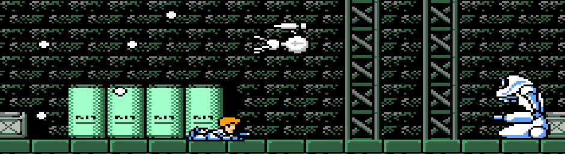

This repo is dedicated to a patch I created for the NES game Journey To Silius. The patch revamps the system which drops health and weapon energy items, which reduces the absurd difficulty of the game. However even with this patch, the game is still very, very hard. Care was taken to ensure that nothing else in the base game was changed, and everything is tested and working.

This README contains a lot of design and technical details. This is largely for my own benefit (should I have to come back and change something), however those interested in a *fairly* simple explanation on how to modify NES games would find it useful as well. The only thing harder than Journey To Silius will be the Journey To The End Of This README.

# Table of Contents
1. [Installation](#installation)
1. [Why The Patch Was Created](#why)
    1. [Background](#background)
    1. [On "Fixing" the game](#fixing)
    1. [Why It's So Hard](#problem)
    1. [The Solution](#design_solution)
    1. [The Item Drop System](#old_ids)
    1. [The Result](#design_result)
1. [How It Was Changed](#how)
    1. [Introduction](#how_intro)
    1. [Tools](#tools)
    1. [Debugging: Modern Day Detective Work](#debugging)
    1. [The Item Drop System](#tech_ids)
    1. [The Solution](#tech_solution)
    1. [The New Item Drop System](#new_ids)
    1. [The Blacklist Function](#blacklist)
    1. [Enemy Id Storing Function](#enemy_id)
    1. [Calling Beef](#calling_beef)
    1. [Testing](#testing)
1. [Conclusion](#conclusion)
1. [Acknowledgements](#acknowledgements)

## **Installation**  
To install the patch, follow these steps:
* Have a copy of the Journey To Silius .NES file (*These steps will override the existing file, so make sure to copy the original if you wish to have a vanilla version of the ROM*)
* Download the patch `JourneyToSilius_Fair.ips` from this repository [(link)](https://github.com/schil227/JourneyToSiliusFair/blob/main/JourneyToSilius_Fair.ips).
* Download [Lunar IPS](https://www.romhacking.net/utilities/240/), a program which can be used to apply the patch
* Run Lunar IPS
    * Select "Apply IPS Patch"
    * Locate the JourneyToSilius_Fair.ips file
    * Next, Locate the vanilla Journey To Silius .NES file (again, I suggest making a copy beforehand)
* Load the newly-patched ROM (.NES file) into your emulator of choice.

## **Why The Patch Was Created** 

This section explains why the patch was created, including some (non-technical) design analysis.

### **Background** 
[Journey To Silius](https://en.wikipedia.org/wiki/Journey_to_Silius) is a fantastic run-and-gun game released on the Nintendo Entertainment System in 1990. It has all the hallmarks of a classic NES game; the game-play is fast and addicting, the graphics are beautiful, and the music is renown for how kick-ass it is. The game is also very, very difficult.

Being hard-as-nails is a common attribute among NES games. For the majority of which, the result is playing the game for a few minutes, and giving up. However there are a few diamonds which I just keep coming back to; including Journey to Silius. I played it at a young age and would rarely get past the first level, but still, its polish left an impression on me. I *want* to get further, I *want* to beat it - yet despite how wonderful the game is, it suffers from a few flaws that make it unreasonably hard.

Having grown from a small boy into a big man child, I've happened to gain some skills which I can use to remedy this. I have taken it upon myself to improve the game, with the goal of making it a little more fair.

**tl;dr**: It is an awesome game which is incredibly difficult.

### **On "Fixing" the game** 
I realize this may come across as saying that there's something wrong with the game, or that "bad game design" is afoot. I do not wish to imply either. Journey to Silius is a great game that had a lot of love and hard work poured into it, and was made with what was, at the time, state-of-the-art game design. 

  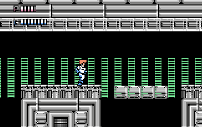
   
  "State-of-the-Art"

This patch does not intend to cheapen the experience; in fact it aims to keep the game as close to its normal form as possible. All this patch does is to "fix" (again, a term I'm not using lightly) one of the things which makes the game so difficult.

**tl;dr**: This patch aims to make the game beatable, while respecting the original vision.

### **Why It's So Hard** 
There's two things which, when mixed, make the game very, very hard.

   
    

The first thing: Limited Continues. The mechanics of the game dictate that you have three lives and three continues, giving you 12 chances to beat the game before you're booted all the way back to the start menu. There are five levels in the game. There are (thankfully) checkpoints within the areas, however if you lose your last life and continue, you must start the area over again. Ghosts 'n Goblins (NES) - another hard-as-nails game - looks generous by comparison. It has unlimited continues and always starts you from your checkpoint, and is an order of magnitude easier as a result.

Limited continues means you will be replaying the beginning of the game over and over, ever facing the existential threat of losing all your progress. You may have a good run, but if you drop the ball then the experience is quick to sour. On the other hand, it gives real stakes to the game - something which is all but abandoned now-a-days.

  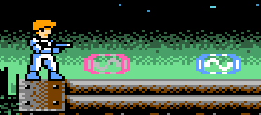 
    Here's something you'll never see in the base game.

The other thing: restoration items are exceedingly rare. You are absolutely anemic for HP; there is little room for forgiveness in a game which throws so much at you. There are a few cases where it is *nearly impossible* to avoid getting hit (certain spots in level 2 and level 4 come to mind), and having to tank a hit comes at a high price.

    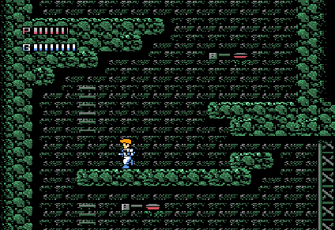 
    Uh huh.

The result is frustration. if you have limited continues and *very* rare health drops, it's effectively like having a finite number of HP (Maximum HP * 3 lives * (3 + 1) continues). If you have finite HP, taking a hit in level one means you're paying for it in level 5. Every hit is demoralizing, and your last life and eating a continue on a boss is practically a death knell to your run. You could probably count on one hand the number of health drops you get, and you don't need any hands to count all the good it does for you.

  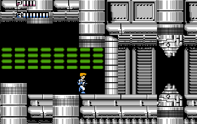
   
  yep.

Putting these two problems together, you see the bigger problem. Limited continues and rare health drops means you have to play perfectly from start to finish. You'll also need to have encyclopedic knowledge of the levels to do so, requiring you to play perfect many times just to learn what will kill you in the next level. The end result? Most players, including myself, give up.

**tl;dr**: Limited continues and very scarce health drops compound to make completing the game a Herculean task.

### **The Solution** 

The art of creating a patch to improve a game requires striking a balance between giving the player more power, but also keeping the original vision of the game in check. Giving the player too much power which trivializes the challenge of the game also trivializes the reward of beating it. Not enough, and we get the same outcome; players dropping the game after giving it a reasonable shot.

Increasing the drop of health restoration items seems like the best solution. The game already drops health restoration for the player, so there is a system in place to help the player along, however it remains woefully ineffective. By tweaking this, players can be given a lot more grace for all the challenges which lie ahead. It's like Super Mario Bros. - getting that power up at the half-way point of the level makes all the difference in the world. 

Increasing item drops also has the added benefit of improving the player's play-style. By changing the chance of weapon energy drops, the player is free to use their arsenal to get through tough spots in the level, without worrying about sparsely rationing it to fight the boss at the end. There still has to be *some* concern over conserving weapon energy, however the player doesn't have to stick with their pea-shooter the entire game.

Removing the continue system would've been (presumably) a very easy change, however I think that's going too far. Having unlimited continues deflates the challenge; sure you have to beat the level within three lives, however there's no sense of endurance - the soul of a NES games. With unlimited continues, you won't care if you burn two of your three lives on a level to beat it, leaving nothing for the next. Giving the player a chance to conserve their lives with item drops means they will value their lives (as everyone should).

**tl;dr**: Fixing the item drop system would significantly improve the odds of players finishing the game, while keeping the game as close to its original vision as possible.

### **The Existing Item Drop System** 

The original Item Drop System (IDS) in the base game is pretty wack. Going into it I assumed that it was just a really, really low chance for Health (HP) drops and a slightly higher chance for Weapon Energy (WE) drops, however it's a bit more complex than that. Admittedly, I do not fully understand how it works; this is because it would require navigating the labyrinth of undocumented assembly code, and way, way more time. A lot of work for something that I'm ultimately going to replace. 

From what I could deduce, the original IDS uses a scoring system. This system updates the score when an enemy is destroyed, and if certain conditions are met, it will either drop HP or WE item. These conditions dictate that *multiple* enemies must be destroyed in order to have a chance of getting an item drop, and if there is an item drop, the player is twice as likely to get a WE drop than a HP drop. And, since the score aggressively resets (presumably every screen-length), there are only so many times within the game where this is possible. The result is a very low drop chance, which does not match the challenges the player is against. I'll go into more detail in the technical section of this document.

The patch cuts down the complexity of the IDS significantly, (mostly) ignoring the scoring mechanism in favor of random chance. After destroying a (standard) enemy, there is a 15% chance for a WE drop or a 15% chance for a HP drop. Unlike the original IDS they happen in the same ratio, giving HP and equal chance to drop. There are some fine caveats to this system which will be outlined in the code-walk of the technical section. 

**tl;dr**: The original item drop system used some sort of (obtuse) scoring mechanism and was unbalanced, whereas the one introduced by the patch has a flat 15% drop chance for both HP and WE.

### **The Result** 

After implementing the new item drop system, I had to tweak it several times - mostly because the drop rate was tuned way too low. I had increased it sparingly, giving a few play tests in-between updates. Once it was set to 15%, it felt right. After *several* attempts at this setting, I was finally able to beat Journey to Silius.

As previously noted, increasing the drop rate for items did alter the game-play. With more chances for health, the player was able to play without excessive punishment for mistakes. Having a high chance for a weapon energy drop meant that the player was able to use their weapons more freely, instead of conserving them for the level-end bosses.

The game is still quite hard; item drops doesn't directly help with boss fights, enemies can still knock you into pits, and throwing caution to the wind will certainly still have a bad outcome for the player. The difficulty and integrity of the game remains intact, while the player is given something to work with. Overall, I'm quite pleased that such a simple change was able to have such an effective outcome. The result is less frustration and drain on the player, and more fun.

**tl;dr**: After tweaking the new item drop system, the game-play was less frustrating, the the game was beatable, but still very challenging.
  

## **How It Was Changed** 
 This is more of an educational section, detailing how I (a novice) was able to use tools to debug and make changes to the 6502 assembly code. Please note that much of this section will be technical, diving into the gory details of RAM values and Assembly. However, I only know so much about this stuff anyway, so hopefully my writing is clear enough for you to follow along as well.

**tl;dr** This section will go over the detective work and technical changes of making the patch.

### **Introduction** 
Modifying the code of a video game may seem like an impossible task; however with some general programming know-how it's actually not too terribly difficult. A the assembly code of an NES game can be viewed using several tools, and altered using a simple hex editor. Before this project, I've had almost no experience with the Assembly language; however a general knowledge of software design appears to be more valuable (especially when the change you plan on making is relatively slight).

75% of the work involved with this patch was watching RAM values change in the debugger and figuring out what the code was doing. About 15% of it consisted of actually coding in assembly, and the last 10% was testing it out.

**tl;dr**: With mediocre skills, I was able to make a patch.
  

### **Tools** 
Using a Windows PC, I required three tools to make this patch:
* [FCEUX](https://fceux.com/web/home.html) (v2.6.4) - An NES emulator tool which can debug NES games, setting break points in the code, view the RAM, etc.
* [HxD](https://mh-nexus.de/en/hxd/) - A tool for editing the hex values of the .NES files
* [Lunar IPS](https://www.romhacking.net/utilities/240/) - A tool for creating/applying patches to .NES files

And of course, the unsung hero, [Notepad++](https://notepad-plus-plus.org/) for taking notes and writing out the draft assembly code.

I should point out that I am fairly new to these tools; perhaps FCEUX lets you modify the .NES files as well, but I was able to get by with these tools.

**tl;dr** I used three, maybe four tools tops.
 

### **Debugging: Modern Day Detective Work** 
Fair warning, this section is mostly just a retelling of my notes in a not terribly interesting way. But, for like six of you out there, it may be interesting (especially if you're curious about how I worked my way to a solution starting from nothing).

As mentioned, most of the time developing this patch was spent figuring out where the code was that I wanted to modify, and how to integrate my desired change. This involved a lot of sleuthing in the code and ram.

  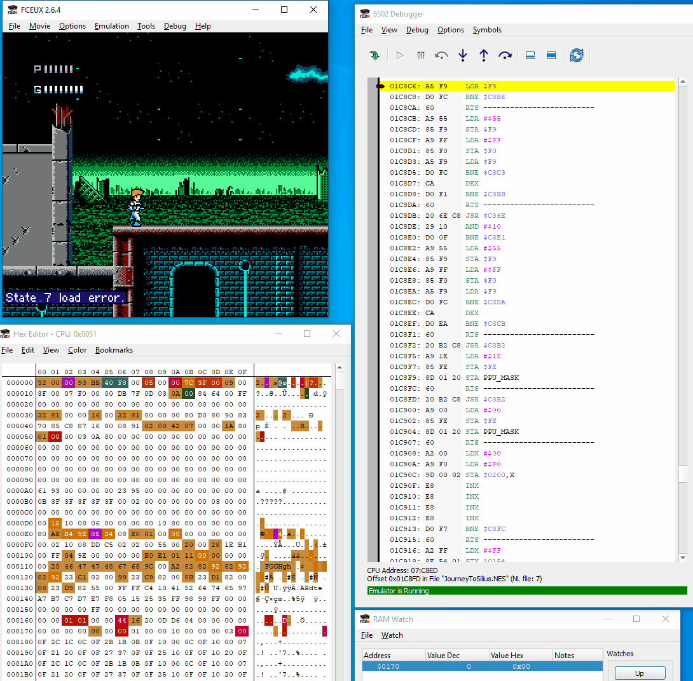
    
  This is pretty much what my screen looked like the entire time.

The above animation demonstrates the FCEUX tool. The top left window is (obviously) the game. The bottom left window displays the current values in RAM, the colors are a heat-map indicating how recently they were changed. The large right-hand window is the assembly code of the game. The emulation can be triggered to pause when certain conditions are met; these are called breakpoints. For example, a breakpoint can be triggered if a read or write is done on a particular address in RAM, or if a certain line of code is executed.

I knew that the code I wanted to alter had to be called when an enemy was destroyed, because destroying an enemy is a pre-condition to spawning an item. Therefore, I began looking for values in RAM that changed when an enemy shows up on screen. At first this may appear daunting, as there are over 65 thousand (0xFFFF) bytes of memory to look through, however with a few quick save states, much of it can be ruled out. For example, memory which updates all the time likely doesn't have anything to do with an enemy's metadata, so large swaths of data can be ruled out.

Eventually I came to the 0x0400 block of memory, which lit up when the first enemy jumped onto screen. Honing in on this, I started to play with the values in RAM while the game was running, and I was able to deduce some things:
* 0x0402 had something to do with applying gravity to the enemy
* 0x0403 moved the enemy vertically
* 0x0404 moved the enemy horizontally
* 0x040A was the timer used by the enemy (For example, setting this to 0xFF for the jumping enemy made them stand still for a long time)

Eventually, I came to 0x0408; this was a special value: it determined what the enemy *was*. For example, the first enemy you see in the game has a value of 0x09. Changing this value changes what that object is - it doesn't even have to be an enemy. After playing with this for a while, I discovered that changing this value to 0x54 turned the enemy into a health restoration item! This was big, as it allowed me to get near to the code which is handling the item drops.

The next step was to set a breakpoint which basically said "If something attempts to write to 0x0408 with a value of 0x54, pause the emulation and point to the line". Then I simply played the game until I got a health drop. After a *long* while, the breakpoint was triggered. It wasn't quite what I was looking for, but still it was insightful. The register 0x18 (a.k.a. 0x0018) wrote the value to 0x0408. If you found yourself asking "Well, what if there's more than one enemy?" this is the answer: the game processes enemies one at a time, and it does that by loading the enemies data (0x04XX) into the "local" registers (0x00XX) and processes what to do with the enemy (or object, I guess). Then once it's finished, it writes back the registers (0x00XX) to the applicable location in RAM (0x040XX).

So, the next step was more or less the same as the previous; except instead of looking for writes to 0x0408, I was looking for writes to 0x18 with values of 0x54. This time, I struck gold:

  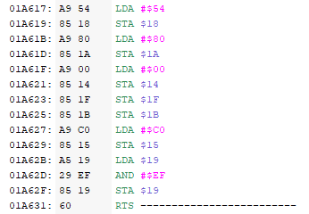

This is the health drop subroutine. To decypher the first two lines:
 * `LDA #$54` means load the number 0x54 (the id of a health item) into the accumulator (a register)
 * `STA $18` means store the current value of the accumulator (0x54) into the RAM address 0x18

 Which then gets propagated to an object on screen (e.g. 0x0408). 

This is great, but it's also not exactly what I wanted. I wanted the function which was calling this, because it was presumably in charge of deciding when a health restoration item was dropped. This part had me stumped for a while, as I was unable to search the assembly code within FCEUX (either because I'm inept or the feature just doesn't exist). But after doing some reading up on assembly, I was able to search the raw hex file for where it was being called.

  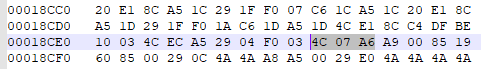
   
  There it is.

Random note: the address 0x01A617 is actually offset by 0x10; so any code which wants to jump to that subroutine is actually looking for 0x01A6**0**7. And because byte order is reversed, I actually want to search for jump calls (`C4`) to `07 A6`. This pointed me to the set of code that caused so much pain over the years: 0x018CE9

  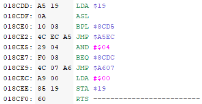
   
  How horrible.

**tl;dr** A fascinating journey starting from nothing and leading to the function in the game's code responsible for item drops.
  

### **The Item Drop System** 

The item drop function reads as follows:
* `LDA $19`: Load the contents of register 0x19 into the accumulator
* `ASL`: shift the bits in the accumulator register to the left by one. 
    * For example, `1001 1111` becomes `0011 1110`.
* `BPL $8CD5`: Branch if positive; jump to address $8CD5 (which is 0x018C**E**5) if the newly shifted value in the accumulator is positive. 
    * That is, if the leftmost bit is `0`. In our previous example, `0011 1110` is positive, so the code would jump accordingly.
* `JMP $A5EC`: This actually jumps to the weapon energy restoration item drop subroutine
* `AND #$04`: Performs a bitwise AND between what's in the accumulator and the number 0x04. Effectively, this checks if the 4's bit is `1`. 
    * For example, decimal 12 AND 4 => `1100` AND `0100` => `0100`
    * decimal 8 AND 4 => `1000` AND `0100` => `0000`
* `BEQ $8CDC`: Branch if equal. This would effectively skip the next instruction to jump to the health drop subroutine.
    * "Branch if equal" is a little misleading in this case. This is checking if the "zero flag" is set, which would occur if the previous `AND` statement resulted in the accumulator getting cleared. 
* `JMP $A607`: Jump to the health restoration subroutine.
* `LDA #$00`: Loads 0x00 into the accumulator (the default case if we never jump to an item sub routine)
* `STA $19`: Stores the value of the accumulator into $19 (the register we initially loaded.)

A few things to point out here:

In order for it to decide whether to drop an item or not, it must base it's decision on some number. In this case it reads from register 0x19, and the value at that register is used to decide whether to drop a Weapon Energy (WE) item or a Health restoration (HP) item. The value in register 0x19 was difficult to decipher. I watched register 0x19 as I played the game to see if I could deduce what effected it, and I found several things:
 * The orientation of the player (facing left/right, jumping, etc.) changed the value by slight amounts.
 * Shooting one bullet on screen would increase the value by one, but many bullets would not continue to increment it.
 * When artillery shells (an enemy which you cannot kill and destroys itself) were on screen, the value was always 3, regardless of the players orientation.
 * Blowing up the jumping enemies set the value to 25, or 29 if you were in the air.
 * Occasionally, the value would jump sporadically - I only noticed this when there were multiple enemies on screen

  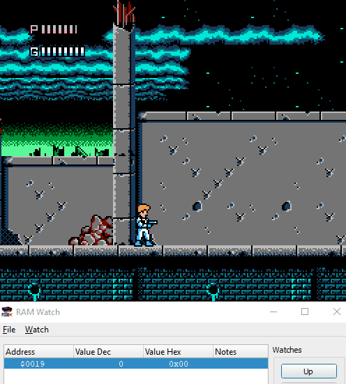

There are two main takeaways from this: 
 1. There are many different things which write to 0x19
 1. The values within 0x19 are not uniform (i.e. it does not produce random numbers, but a set of possible numbers)

The 1st point means that understanding what values are written to 0x19 and *why* is very difficult, since there are so many things that are effecting it at a given time.

 The 2nd point is especially important: it means that I could not simply change the `AND #$04` line to something that would produce more drops (e.g. `AND #$07`) without breaking the game. Of the set of numbers I witnessed from 0x19, they seemed to be very particular.

 What's more, you may have noticed that the item drop chances are not even*. This is because the WE item drop is checked before the HP item drop, and they are comparing against different things. The conditions for these drops are as follows:
  * A: value X is negative (e.g. Left most bit is 1; `1000 0000`)
      * (`1010 0100` satisfies this condition, `0010 0100` does not)
  * B: value X has a `1` in the 4's bit (e.g. `0000 0100`)
      * (`1001 0101` satisfies this condition, `1010 1001` deos not)

These conditions are checked after applying a left shift (`ASL`, e.g. `0101 0101` => `1010 1010`) on the number in question (mostly irrelevant to the logic we're focusing on). For clarity, I will refer to this number as X.

First, we check the negative condition: A(X). If X is negative, the `BPL` is not taken, and instead it moves on to the `JMP` instruction, jumping to the WE item drop subroutine. After the jump, the code returns elsewhere, *not* where we left off in the item drop system function. In the event that X is positive, we take the `BPL` and perform the next check: B(X). If there is a `1` in the 4's place, then we do not take the `BEQ`, instead jumping to the HP item drop subroutine.

You may have noticed that there are cases where X could satisfy both conditions: there are values for X which are both negative and have a `1` in the 4's place (e.g. `1000 0100`). In that case, the game drops a WE item and moves on. Stated another way; **half** of *all possible values* of X that could produce a HP item drop would instead produce a WE item. This explains why there seem to be so many more WE drops in the game and so few HP drops.

After analyzing this function, I decided that the easiest course of action would be to re-write the function, and bypass this logic all together.

 
 <h5>*This technically assumes that the game is not producing values for X which are mutually exclusive, satisfying either condition A or condition B - which I highly suspect is the case</h5>
 
 **tl;dr**: The existing item drop system is cryptic, and does not produce even chances of dropping Weapon Energy and Health Restoration item drops.

### **The Solution** 
The new item drop system would have the following requirements:
* An increased chance at item drops
* An equal chance of either a weapon energy or health restoration item drop
* Items would only drop from enemies that would typically drop these items
    * No drops from artillery shells, mini-bosses, etc.

If my Assembly skills were greater I may have attempted to write something more ambitious, like getting an item drop automatically when you destroy 5 enemies in a row without taking damage or something. But, I think random chance is sufficient enough. I wasn't sure how much I wanted to increase the drop chance, but I did want to start low. Keeping the patch as close to the game's original vision is important, and the change shouldn't be to invasive. Thus, the player shouldn't be showered with items.

I would need a few things to create this function. First, I need to know the Id (i.e. type) of the enemy which was destroyed. Second, I needed a source of randomness

The type of the enemy can be determined by looking at 0x18, however this variable changes by the time the item drop system is invoked. Instead, the value has to be stored in a less volatile place in RAM. For many of the enemy types, we can continue using the "scoring" mechanism of 0x19; when the value is low (e.g. 0x03) then it means that it's a lesser enemy which normally does not drop power ups (such as an artillery shell). 

As far as enemy types not covered by the 0x19 check, there's actually only one other enemy that needs to be accounted for, which is the level 1 sub-boss:

 

  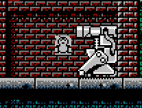  
  This bastard.

This enemy is special because they're the only enemy in the game that drops a level-ending power-up (the machine gun), and they show up again (in level 2) but don't drop anything. I assume that the mysterious 0x19 scoring mechanism makes an exclusion for this enemy type, because after defeating it for the second time on level 2, if it drops a standard HP/WE item, the sprite comes out garbled. Since this is the only enemy in the game where this can happen, we include a specific check to ensure that the destroyed enemy's Id does not equal level 1 sub-boss: `0x0F`.

As for a source of randomness, a counter could be used. A counter is a value that increments or decrements every frame:

 

  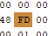  
  This counter counts down from 0xFF to 0x00, then resets to 0xFF (slowed down to 50% speed)

Counters are general purpose and can act as a timers. For our purpose, this works decently well as a sudo-random number generator. This is how it will be used:
* The player will destroy an enemy
* The counter's current value for that frame will be loaded into the accumulator register
    * If the value in the accumulator is between 0xFF and 0xDD, drop a WE item
    * If the value in the accumulator is between 0x22 and 0x00, drop a HP item
    * Otherwise, do nothing

The chance for dropping a WE or HP item are the same, without a number overlap like in the original item drop system. There are 0x21 numbers between 0xFF and 0xDD, as well as 0x22 and 0x00. The reason that we split them up into higher/lower bounds instead of contiguous (e.g. 0x00 <-> 0x22 HP drop, 0x23 <-> 0x44 WE Drop) is because it's a hair easier to program.

With these requirements and inputs squared away, it's time to code.

**tl;dr** Requirements and inputs for the new function have been defined, as well as some nuances around enemy item drops and edge cases. Then at the end I wrote "it's time to code" which was pretty great.

### **The New Item Drop System** 
(Fair warning, my assembly code is probably pretty cringe. No I will not be accepting PRs to improve it.)

When you're as incapable as I am, editing Assembly can be tricky. Since jumping from one line to another is done very specifically using addresses, you can't just make a few newlines and start writing a function as you would in a higher level programming language. Instead you must find greener pastures to raise your cattle. I was fortunate to find such lush green fields:

  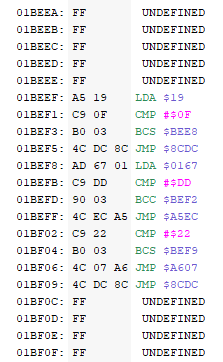  
  We're having steak tonight, mee maw.

The above function, which I affectionately refer to as Beef, is the new item drop system. It functions as follows:

* `LDA $19`: Load the value of 0x19 into the accumulator
* `CMP #$0F`: Compare the value of the accumulator with the number 0x0F"
* `BCS $BEE8`: If the value in accumulator is greater than 0x0F, skip the following jump instruction.
* `JMP $8CDC`: This jumps to the end of the function which used to be responsible for the item drop system. It essentially exits this function.
* `LDA $0167`: This loads the current value of the counter (our sudo-random number generator) from memory into the accumulator.
* `CMP #$DD`: Compare the value in the accumulator to the number 0xDD.
* `BCC $BEF2`: If the value in the accumulator is less than 0xDD, skip the following jump instruction.
* `JMP $A5EC`: Jump to the WE item drop subroutine. From there, it exits this section of code.
* `CMP #$22`: Compare the value in the accumulator to the number 0x22.
* `BCS $BEF9`: If the value in the accumulator is greater than 0x22, skip the following jump instruction.
* `JMP $A607`: Jump to the HP item drop subroutine. From there, it exits this section of code.
* `JMP $8CDC`: This jumps to the end of the function which used to be responsible for the item drop system. It essentially exits this function.

This function accomplishes (most of) the requirements:
* It checks that only enemies with a 0x19 value of 0x0F or greater are eligible for item drops.
* There is a greater chance of an item getting dropped (25% likely-hood of an item getting dropped).
* There is an equal chance of getting a WE or HP item (50% chance each).
* It returns to the end of the original item drop system function, causing minimal interference with the rest of the code.

There is only one condition that it doesn't cover; the check to see if the enemy getting destroyed is the level 1 sub-boss (Id: 0x0F). For that, I thought it best to make another function which guards entry into the Beef function. That way, if I had to append more ids (other than just the check for 0x0F) that could be done without changing (and rewriting) Beef.

**tl;dr**: A new item drop function was implemented in assembly to drop items more frequently and in equal amounts.

### **The Blacklist Function** 

 

  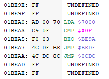  
  The black-list function.

This function is a black-list function (with only one thing on the list). It checks if the enemy that was destroyed is equal to 0x0F. If it is, it jumps to the end of the old item drop function. Otherwise, it calls Beef (`$BEDF`). From outside code, this is the defacto entrypoint to the new item drop system.

I wont bother walking through the code again since it's so short, but I will point out that 0x7000 is a random location in RAM which I chose to store the destroyed enemy's Id before it gets changed. 

Next, I will show off the function for writing the enemy Id to the special place (0x7000) in RAM.

**tl;dr** The blacklist function exists to prevent item drops for certain enemies.
  

### **Enemy Id Storing Function** 
Not a very interesting name, but it's clear enough.

 

 
  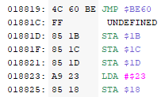 
  
  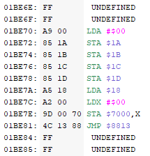  
  The code where the enemy Id storing function is called (left), and the enemy Id storing function (right).

This code will look a bit "hacky-er", so i decided to include the where the function is getting invoked in addition to the function itself. The code on the left (referred to as the "calling function") gets called immediately after the enemy sustains a mortal blow. `0x18` stores the id of the enemy, and when the enemy gets destroyed, their Id gets changed from whatever it is to the "explosion" object (Id `0x23`). You can see this happening on the calling function when it loads `0x23` into the accumulator and stores it into `0x18` (`LDA #$23`, `STA $18`). So before that, we need to store the enemy Id somewhere in RAM.

In order to store the Id somewhere in RAM, we need to figure out where to put it. Looking at the available values in RAM, I noticed that large parts of it appeared untouched - so I picked an easy to remember location (`0x7000`). But looking at the calling function, there really isn't any room to add the instructions to store it there. This required a bit of improvisation.

There are some instructions assigning `0x00` to a few registers before the enemy id gets wiped out. The solution I came up with was to branch off to a separate function (the "enemy id storing" function) at the beginning of this, write `0x00` to all the fields it required, then store the enemy id (address `0x18`) into a new location `0x7000`. Once finished, it would jump back to the end of the calling function, and resume assigning `0x23` to address `0x18`. Kind of like doing a bypass around a clotted artery.

The result is, effectively none of the existing code is altered, and the enemy id gets stored somewhere to be used later.

**tl;dr**: The enemy id is stored without upsetting the existing code.

### **Calling Beef** 
Much like at a restaurant, the burger doesn't get made unless you order it. 

 

  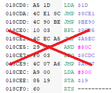  
  Like a dollar menu after inflation.

So this was the old item drop system function, which has now been augmented to call into our new item drop system function. It doesn't call into Beef directly, mind, but the guardian blacklist function first. The entry point being the `JMP` instruction at address `0x018CDD` (`JMP $BE90`). Once the blacklist/Beef functions finish, they either jump back to `0x18CEC` (in the event no item is dropped) or they return to the function on the stack (as dictated by the `RTS` command). The middle instructions (between `0x018CE0` -> `0x018CE9`) are all ignored in favor of the new item drop system. The result is the seamless integration of some fancy new functions which do not alter anything in the base game, except the item drops.

**tl;dr**: The new code is invoked instead of the existing item drop system, and all other existing behavior is intact.

### **Testing** 
I finally got to live out 10-year-old-me's dream job of being a video game tester, and boy did I dodge a bullet.

 

    
  Unlike in the game haw haw.

Suffice to say, increasing the drop rate (especially for health recovery items) decreased the difficulty of the game - however, the game is still very difficult. Before the patch, I would almost without fail get game over on level three every time - after the patch, I was able to get to level four. However beyond level three, there is yet another uptick in difficulty: there's pits, swooping enemies, swooping enemies that knock you into pits, bosses that are mostly invulnerable, bosses that knock you into pits, gamey jumping off of boxes, boxes that knock you into pits, etc. In short, in order to progress, you are going to die *a lot*.

  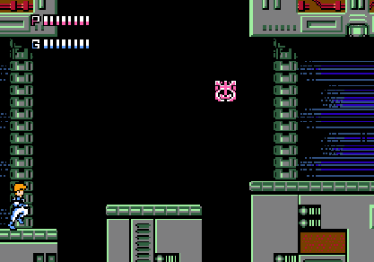
    
  See?

This is where I see the real value of adding more health drops shines: the player is able to gain the encyclopedic knowledge required to pass a level without the very tedious threat of starting over from level one. You have more chances to learn how to jump from falling blocks, the attack patterns of bosses, what weapons work best for tough spots in the levels. Ultimately, it's a way to mitigate the burnout that causes so many people to give up on tough games.

  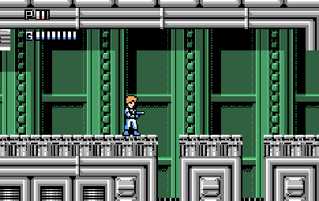
    
  Just think, you could've used up your last continue to learn about this!

After several attempts, I was clearly becoming better at the game. I knew what enemies were coming up and how to dispatch them. How best to fight the sub and main bosses. How to navigate the dastardly side-scrolling level five. And, I'm pleased to announce that on my final continue and last life, *by the skin of my teeth*, I was able to beat the final boss.

**tl;dr** After significant consternation, I beat Journey to Silius.

## **Conclusion** 

  

One must ask the objective question: is the experience of beating Journey to Silius cheapened because of this patch, which technically made the game easier?

Before this exercise, I may have said 'yes' - however after completing the game I can say 'no' with confidence.

In the decades since the NES, the video game industry has clearly toned down the difficulty of the average video game. Outside of a few niche titles there are no limited continues, and even the concept of lives has been fading. The stakes in modern games are so low, and the punishment so light for failing, that even some of the most difficult titles of today struggle to stand against the legendary difficulty of the NES-era. 

I'd like to think there is a balance to be struck, and this patch accomplishes it. The added health drops only get you so far; with bosses you're completely on your own, and health is almost irrelevant on the level 5 meat grinder. To beat the game, it comes down to skill and knowledge - things which you are barred from by a wall of tedium. 

What gives me the most assurance was how I felt as I was fighting the final boss. My heart was racing and I was focusing on my breathing. I only had one life left, and I had to pause the game and think of a strategy because *this was it*. After the final blow, the yummy wave of dopamine came and I felt like I had actually accomplished something. *This* was NES hard.

I am aware that this is a consensus of one, so I welcome the community to test out this patch and share their opinions, especially if this is a game you shelved because of its difficulty.

## Acknowledgements 
First, I'd like to thank the [Displaced Gamers](https://www.youtube.com/@DisplacedGamers) Youtube channel, which gave me the inspiration in the first place. They make a ton of good stuff regarding the coding of older games, including exploring bugs and the like. I would recommend their video on [Super Mario Bros. 2](https://youtu.be/y33rn-I-mIs)

Second, I'd like to thank you for reading this, and hopefully enjoying the patch.
